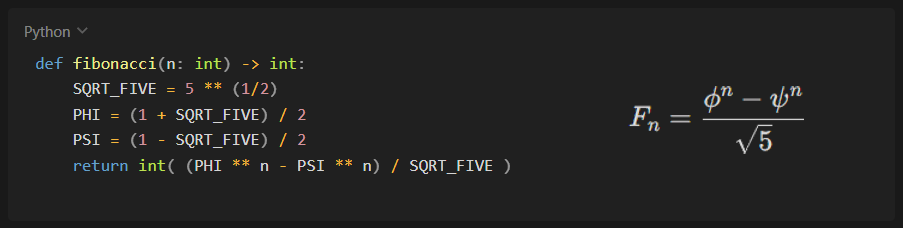

# Fibonacci-Algorithms

Esse repositório contém diferentes implementações para uma função que retorna o N-ésimo termo da sequência de Fibonacci. Além de uma análise de complexidade e demonstração via técnicas algébricas.



<hr>

## Arquivos
- Analise_de_Algoritmos_de_Fibonacci.pdf
- fibonacci_binet.py
- fibonacci_iterativa.py
- fibonacci_matrix.py
- fibonacci_recursion.py

<hr>

clone o repositório:

```bash
git clone https://github.com/gabrieldsn2006/Fibonacci-Algorithms.git